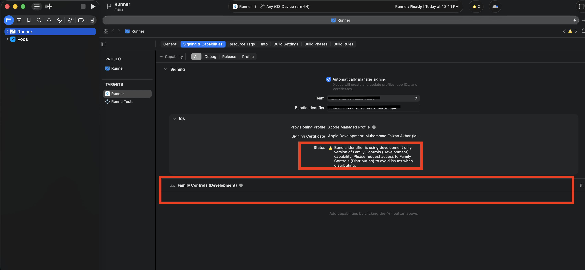

# flutter_screen_time

Flutter Screen Time lets you block distracting apps on **iOS and Android**.

| iOS | Android |
| :-: | :-: |
|  |  |

## Features

- Get permission status
- Select apps to block
- Block/unblock apps
- Customise the Android blocking overlay UI (title, message, colours, text sizes, buttons)

## Installation

Add the plugin to your `pubspec.yaml` file:

```yaml
dependencies:
  flutter_screen_time_api: ^1.0.0
```

## How it works

iOS and Android use very different mechanisms:

- **iOS** uses the first-party **Family Controls / Screen Time** API. You configure the shield with `setShieldConfiguration`.
- **Android** has no system-level Screen Time API, so blocking is built from two special-access permissions the user must grant — **"Display over other apps"** (to draw the shield) and **"Usage access"** (to detect the foreground app). A foreground service then polls the current app and draws a full-screen overlay over blocked apps. You customise that overlay with `configureAndroidOverlayUI`.

The public Dart API is shared across both platforms:

```dart
final _flutterScreenTimePlugin = FlutterScreenTime();
```

## Prerequisite

### iOS

Make sure your Xcode target has the **Family Controls** capability enabled.



### Android

No manifest changes are required — the plugin declares the permissions it needs
(`SYSTEM_ALERT_WINDOW`, `PACKAGE_USAGE_STATS`, `FOREGROUND_SERVICE`, …). The two
special-access permissions are granted by the user at runtime; calling
`getAuthorization()` opens the relevant system settings screens for them.

## Setup

### Create Object

```dart
final _flutterScreenTimePlugin = FlutterScreenTime();
```

### 1. Permission Information

```dart
Future<int> checkAuthorization() async {
  return await _flutterScreenTimePlugin.checkAuthorization();
}
```

```
Statuses:
-1 -> Permission denied
 1 -> Permission granted
 0 -> Not determined
```

> On Android this returns `1` only when **both** the overlay and usage-access
> permissions are granted, otherwise `0`.

### 2. Get Permission

```dart
void getAuthorization() {
  _flutterScreenTimePlugin.getAuthorization();
}
```

> On Android this opens the "Display over other apps" screen first and then the
> "Usage access" screen (they can't be requested together).

### 3. Choose Apps to block

```dart
void chooseApps() {
  _flutterScreenTimePlugin.chooseApps();
}
```

> On Android this launches a native app picker (the analog of the iOS
> `FamilyActivityPicker`).

### 4. Block apps

```dart
void blockApps() {
  _flutterScreenTimePlugin.blockApps();
}
```

### 5. Unblock apps

```dart
void unblockApps() {
  _flutterScreenTimePlugin.unblockApps();
}
```

## Android — Customise the blocking overlay

Use `configureAndroidOverlayUI` to style the full-screen overlay shown on top of
a blocked app. It is **Android-only** (a no-op on iOS) and every field is
optional — anything you leave out keeps its built-in default. Colors accept
`#RGB`, `#RRGGBB` or `#RRGGBBAA` (alpha last).

```dart
await _flutterScreenTimePlugin.configureAndroidOverlayUI(
  const AndroidOverlayConfiguration(
    title: 'Stay focused',
    message: 'This app is blocked during focus hours.',
    backgroundColorHex: '#111827',
    titleColorHex: '#FFFFFF',
    messageColorHex: '#D1D5DB',
    primaryButtonLabel: 'Got it',
    primaryButtonBackgroundColorHex: '#2563EB',
    primaryButtonTextColorHex: '#FFFFFF',
    secondaryButtonLabel: 'Close',
    secondaryButtonBackgroundColorHex: null, // outlined button
    secondaryButtonTextColorHex: '#FFFFFF',
    titleFontSize: 24,
    messageFontSize: 16,
    cornerRadius: 12,
  ),
);
```

### `AndroidOverlayConfiguration` fields

| Field | Type | Default | Description |
| --- | --- | --- | --- |
| `title` | `String` (required) | `App blocked` | Bold heading at the top of the overlay. |
| `message` | `String?` | `This app is blocked right now.` | Supporting line under the title. Hidden when null/empty. |
| `backgroundColorHex` | `String?` | `#111827` | Overlay background fill. |
| `titleColorHex` | `String?` | `#FFFFFF` | Title text colour. |
| `messageColorHex` | `String?` | `#D1D5DB` | Message text colour. |
| `primaryButtonLabel` | `String?` | `OK` | Primary (dismiss) button label. |
| `primaryButtonBackgroundColorHex` | `String?` | `#2563EB` | Primary button fill. |
| `primaryButtonTextColorHex` | `String?` | `#FFFFFF` | Primary button text colour. |
| `secondaryButtonLabel` | `String?` | _none_ | Optional secondary button label. Hidden when null/empty. |
| `secondaryButtonBackgroundColorHex` | `String?` | _outlined_ | Secondary button fill. When null the button is outlined. |
| `secondaryButtonTextColorHex` | `String?` | `#FFFFFF` | Secondary button text colour. |
| `titleFontSize` | `double?` | `24` | Title text size (sp). |
| `messageFontSize` | `double?` | `16` | Message text size (sp). |
| `cornerRadius` | `double?` | `12` | Button corner radius (dp). |
